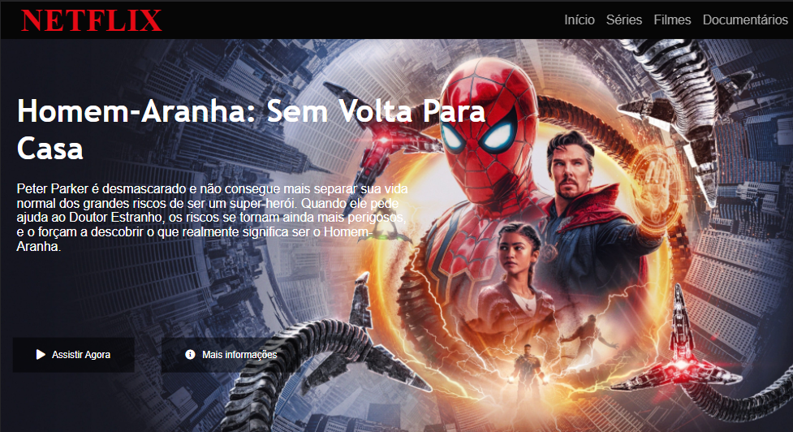
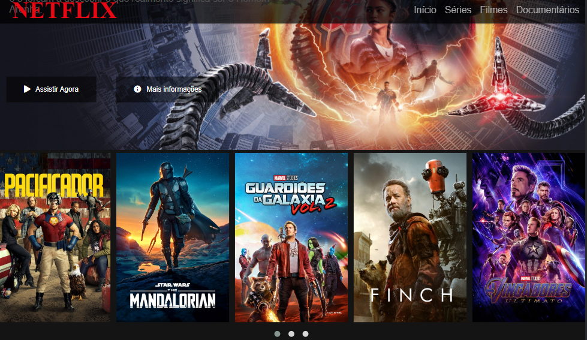

<h1 align="center">Interface da netflix</h1>

Recriando a interface da Netflix para fins educacionais.

 <a href="#Descrição">Descrição</a> •
 <a href="#Tecnologias">Tecnologias utilizadas</a> •
 <a href="#autor">Autor</a>

---

 

<h1 align="center">  
  

  
  
  

</h1>

### Descrição

Clone da página do Netflix realizado no bootcamp da Digital Innovation One.

### Tecnologias utilizadas

As seguintes ferramentas foram usadas na construção do projeto:

- [TypeScript](https://www.typescriptlang.org/)
- [React Native](https://reactnative.dev/)
- [Weather API](https://openweathermap.org/api)
- [Context API](https://pt-br.reactjs.org/docs/context.html)
- [React Native Geolocation Service](https://github.com/Agontuk/react-native-geolocation-service)
- [React Navigation](https://reactnavigation.org/)
- [React Native Vector Icons](https://github.com/oblador/react-native-vector-icons)
- [UnForm](https://unform.dev/)
- [Yup](https://github.com/jquense/yup)
- [Styled Components](https://styled-components.com/)
- [Axios](https://github.com/axios/axios)
- [Eslint](https://eslint.org/)
- [Prettier](https://prettier.io/)
- [EditorConfig](https://editorconfig.org/)

---

### Autor

Made with 💜 by Renan Cesar 👋

